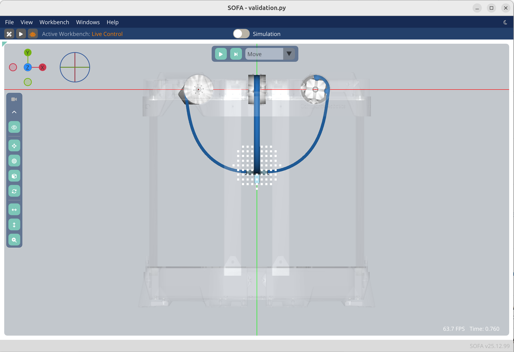

# Emio.validation

- `modules/targets.py` : generate targets for Emio
- `validation.py` : simulation of Emio, with an animation (move to generated targets)
- `data/results` : directory containing the collected positions