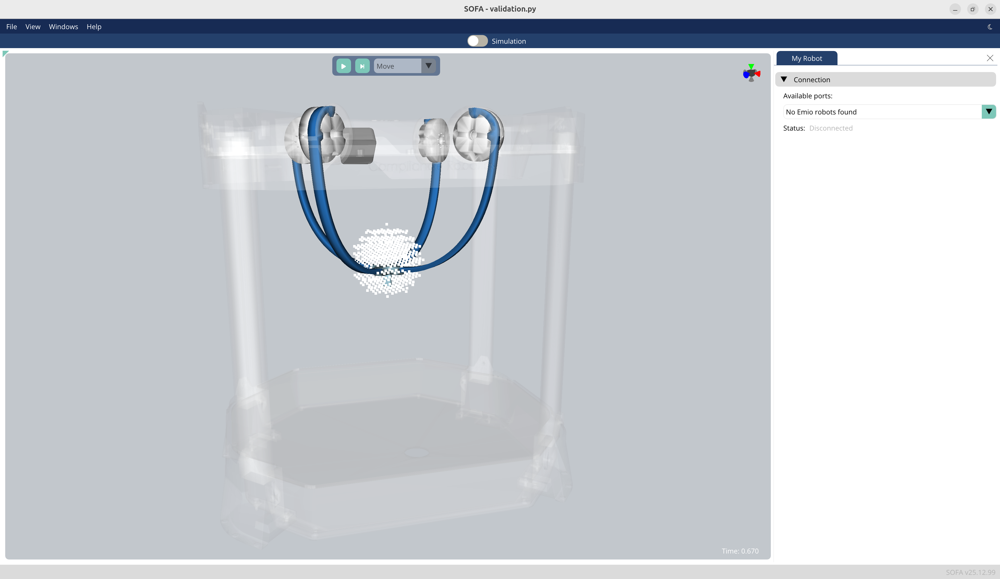

# Emio.validation

This repository contains validation tools for [Emio](https://compliance-robotics.com/compliance-lab/). It compares simulation results with real-world measurements obtained from different sensors (Polhemus and camera) to validate the accuracy of the simulation model.

The validation workflow:
1. Target points are generated from a script (e.g. sphere points cloud)
2. We use the simulation to solve the inverse kinematics of Emio
3. Emio's effector move to each target point, we wait a few moments, and take measurements from the real device
4. The measurement results are then compared:    
    - Error between the targets and the simulation results    
    - Error between the targets and the polhemus results    
    - Error between the targets and the camera results

**Note:** All measurements are in millimeters (mm).

- `modules/targets.py`: generate targets for Emio
- `modules/measurements.py`: script used to generate the image `data/images/plots.png`
- `modules/polhemusUSB.py`: utils to use the Polhemus sensor device 
- `validation.py`: simulation of Emio with inverse kinematics, featuring an animation that moves the effector to generated target points, waits, and triggers measurements
- `data/results`: directory containing the collected positions
